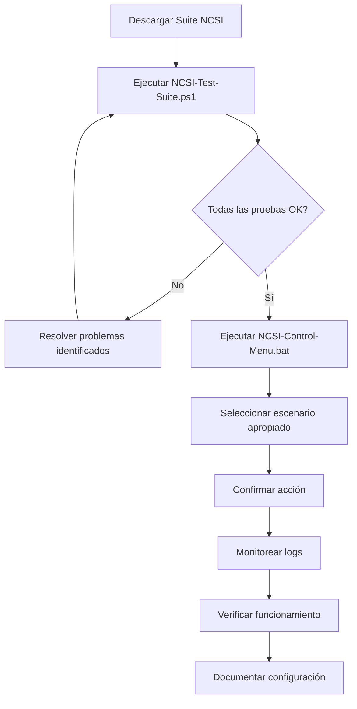

# 🚀 Guía de Despliegue - Suite NCSI Local Server

## 📋 Resumen Ejecutivo

Esta suite automatiza **completamente** la implementación de un servidor NCSI (Network Connectivity Status Indicator) local para **eliminar el molesto mensaje "Sin Internet"** en redes empresariales con acceso restringido.

### ✨ **Nuevas Características v1.0**

- 🎮 **Menú principal en batch** con elevación automática de privilegios
- ✅ **Confirmaciones antes de cada acción** para mayor seguridad
- 🔄 **Bypass automático** de execution policy
- 📝 **Logging centralizado** de todas las operaciones
- 🧪 **Suite de pruebas** para verificar compatibilidad

---

## 🎯 Instrucciones de Despliegue Rápido

### 📦 **Paso 1: Descarga de Archivos**

Descargue **todos** los archivos de la suite en una carpeta del sistema de destino:

```
📁 NCSI-Suite/
├── 🎮 NCSI-Control-Menu.bat           (ARCHIVO PRINCIPAL)
├── 🚀 Quick-Install.ps1               (Instalación express)
├── ⚙️ NCSI-LocalServer-Automation.ps1 (Automatización completa)  
├── 🛠️ NCSI-Advanced-Tools.ps1         (Herramientas avanzadas)
├── 🧪 NCSI-Test-Suite.ps1             (Verificación del sistema)
├── 📚 NCSI-Script-Documentation.md    (Documentación detallada)
├── 📋 NCSI-Scripts-README.md          (Guía de la suite)
└── 📖 DEPLOYMENT-GUIDE.md             (Este archivo)
```

### 🎮 **Paso 2: Ejecución del Menú Principal**

**¡NUEVO! Ya no necesita "ejecutar como administrador"**

```batch
# Simplemente haga doble clic en:
NCSI-Control-Menu.bat

# O desde línea de comandos:
NCSI-Control-Menu.bat
```

El script **automáticamente**:
- ✅ Detecta si necesita privilegios de administrador
- ✅ Se eleva automáticamente (aparecerá UAC)
- ✅ Abre una nueva ventana con privilegios
- ✅ Configura bypass de execution policy
- ✅ Muestra menú interactivo

### 🎯 **Paso 3: Selección de Escenario**

El menú presenta **13 opciones organizadas** por categoría:

#### 🚀 **INSTALACIÓN Y SETUP**
- **[1] 🟢 Instalación Express** - Para usuarios básicos (5 minutos)
- **[2] ⚙️ Instalación Completa** - Con backup y verificación
- **[3] 💾 Crear Backup** - Guardar configuración actual
- **[4] 🔄 Restaurar Backup** - Desde backup previo
- **[5] 🧪 Verificar Configuración** - Test completo
- **[6] 🗑️ Desinstalar NCSI** - Remover XAMPP

#### 🛠️ **HERRAMIENTAS AVANZADAS**
- **[7] 📊 Monitoreo Continuo** - Vigilancia en tiempo real
- **[8] 🏢 Configuración GPO** - Para Active Directory
- **[9] 🔍 Diagnósticos Avanzados** - Análisis completo
- **[10] 🔒 Configuración SSL** - Soporte HTTPS
- **[11] 🏥 Verificación de Salud** - Health check
- **[12] 📋 Estado del Sistema** - Reporte de status

#### ❌ **[13] Salir del Programa**

---

## 🎯 Escenarios de Uso Recomendados

### 🏠 **Escenario 1: Usuario Doméstico/SOHO**
**Objetivo**: Eliminar "Sin Internet" en casa/oficina pequeña

```batch
1. Ejecutar: NCSI-Control-Menu.bat
2. Seleccionar: [1] Instalación Express
3. Confirmar instalación
4. ¡Listo en 5 minutos!
```

### 🏢 **Escenario 2: Oficina Corporativa (10-100 PCs)**
**Objetivo**: Servidor centralizado + configuración manual

```batch
# En servidor dedicado:
1. Ejecutar: NCSI-Control-Menu.bat
2. Seleccionar: [2] Instalación Completa
3. Usar IP estática del servidor (ej: 192.168.1.10)

# En clientes (manual o script):
4. Seleccionar: [8] Configuración GPO (si hay AD)
   O configurar registro manualmente
```

### 🏭 **Escenario 3: Empresa con Active Directory**
**Objetivo**: Despliegue masivo via GPO

```batch
# En servidor NCSI:
1. Ejecutar: NCSI-Control-Menu.bat
2. Seleccionar: [2] Instalación Completa
3. Confirmar con IP/FQDN del servidor

# En controlador de dominio:
4. Seleccionar: [8] Configuración GPO
5. Configurar monitoreo: [7] Monitoreo Continuo
```

---

## ✨ Mejoras de Seguridad Implementadas

### 🔒 **Confirmaciones Obligatorias**

Cada acción **crítica** ahora requiere confirmación explícita del usuario:

```
🤔 Confirmación de Instalación
   Esta operación descargará e instalará XAMPP (~150MB) y configurará 
   el registro de Windows para NCSI local. ¿Desea continuar?
   
¿Continuar? (S/n): _
```

### 🛡️ **Validaciones Previas**

Antes de cualquier cambio, el sistema verifica:
- ✅ Permisos de administrador
- ✅ Existencia de scripts requeridos
- ✅ Estado actual del sistema
- ✅ Disponibilidad de recursos

### 📝 **Logging Centralizado**

Todas las operaciones se registran automáticamente:
```
Archivo de log: %TEMP%\NCSI-Control-Menu-YYYYMMDD.log
Contenido: [TIMESTAMP] [LEVEL] Mensaje detallado
```

---

## 🧪 Verificación del Sistema

### **NUEVO: Suite de Pruebas Automática**

Antes de instalar, puede verificar la compatibilidad:

```batch
# Desde el sistema de archivos:
powershell -ExecutionPolicy Bypass -File "NCSI-Test-Suite.ps1"

# Verificación detallada con reporte:
powershell -ExecutionPolicy Bypass -File "NCSI-Test-Suite.ps1" -Detailed
```

**La suite verifica:**
- ✅ Existencia de todos los scripts
- ✅ Versión de PowerShell (≥5.0)
- ✅ Permisos de administrador
- ✅ Conectividad a internet
- ✅ Espacio en disco disponible
- ✅ Configuración de red actual
- ✅ Instalación previa de XAMPP
- ✅ Disponibilidad del puerto 80
- ✅ Acceso al registro de Windows
- ✅ Estado de servicios Windows

**Resultados típicos:**
```
═══════════════════════════════════════════════════════════════
                    TEST SUMMARY REPORT
═══════════════════════════════════════════════════════════════

Total Tests: 15
✅ Passed: 13
⚠️ Warnings: 2
❌ Failed: 0

🎉 Tests passed with warnings - Installation possible but review warnings

Recommendations:
• Review WARNING tests - may affect installation
• Run: NCSI-Control-Menu.bat for guided installation
```

---

## 📊 Matriz de Características por Script

| Función | Control Menu | Quick Install | Automation | Advanced Tools | Test Suite |
|:--------|:------------:|:-------------:|:----------:|:--------------:|:----------:|
| **Elevación Auto** | ✅ | ❌ | ❌ | ❌ | ❌ |
| **Bypass Policy** | ✅ | ❌ | ❌ | ❌ | ❌ |
| **Confirmaciones** | ✅ | ⚠️ Básicas | ✅ Completas | ✅ Críticas | ❌ |
| **Menú Navegable** | ✅ | ❌ | ❌ | ❌ | ❌ |
| **Instalación XAMPP** | 🎮 Orquesta | ✅ Rápida | ✅ Completa | ❌ | ❌ |
| **Backup/Restore** | 🎮 Orquesta | ❌ | ✅ | ✅ | ❌ |
| **Configuración GPO** | 🎮 Orquesta | ❌ | ❌ | ✅ | ❌ |
| **Monitoreo** | 🎮 Orquesta | ❌ | ❌ | ✅ | ❌ |
| **Verificación** | 🎮 Orquesta | ⚠️ Básica | ✅ Completa | ✅ Avanzada | ✅ Completa |
| **Logging** | ✅ Completo | ⚠️ Básico | ✅ Detallado | ✅ Avanzado | ✅ Reportes |

**Leyenda:**
- ✅ = Función completa
- ⚠️ = Función básica
- ❌ = No disponible  
- 🎮 = Orquesta otros scripts

---

## 🚨 Solución de Problemas Rápida

### ❌ **"Access Denied" o "Execution Policy"**
**Solución**: Use el menú principal `NCSI-Control-Menu.bat` - maneja automáticamente la elevación y bypass

### ❌ **"Scripts not found"**
**Solución**: Asegúrese de que todos los archivos están en la misma carpeta

### ❌ **"Port 80 in use"**
```batch
# Identificar proceso:
netstat -ano | findstr ":80"

# Detener IIS si está activo:
iisreset /stop
```

### ❌ **"Cannot download XAMPP"**
**Solución**: Verificar conexión a internet o usar instalación manual de XAMPP

### ❌ **"Registry access denied"**
**Solución**: Verificar que está ejecutando como administrador (UAC debe aparecer)

---

## 📈 Flujo de Trabajo Recomendado

### 🔄 **Para Implementación en Producción**



### 📝 **Checklist de Despliegue**

- [ ] **Pre-instalación**
  - [ ] Descargar todos los archivos de la suite
  - [ ] Ejecutar `NCSI-Test-Suite.ps1` para verificar compatibilidad
  - [ ] Revisar y resolver cualquier WARNING o ERROR
  - [ ] Identificar IP estática para el servidor (si aplica)

- [ ] **Instalación**
  - [ ] Ejecutar `NCSI-Control-Menu.bat`
  - [ ] Permitir elevación UAC cuando aparezca
  - [ ] Seleccionar opción apropiada para el entorno
  - [ ] Confirmar cada acción cuando se solicite
  - [ ] Monitorear logs durante el proceso

- [ ] **Post-instalación**
  - [ ] Verificar acceso a `http://[SERVER-IP]/connecttest.txt`
  - [ ] Confirmar que devuelve "Microsoft Connect Test"
  - [ ] Reiniciar servicio NLA: `net stop NlaSvc && net start NlaSvc`
  - [ ] Verificar ícono de red muestra "Conectado"
  - [ ] Documentar configuración final

- [ ] **Para entornos empresariales**
  - [ ] Configurar GPO usando opción [8]
  - [ ] Establecer monitoreo continuo opción [7]
  - [ ] Configurar SSL si es requerido opción [10]
  - [ ] Programar health checks periódicos opción [11]

---

## 🎉 Resultado Final Esperado

Después de ejecutar la suite exitosamente:

### ✅ **En el Cliente**
- El ícono de red Windows muestra **"Conectado"** o **"Acceso a Internet"**
- Las aplicaciones (OneDrive, Teams, etc.) funcionan normalmente
- No aparece más el mensaje confuso de "Sin Internet"

### ✅ **En el Servidor**
- XAMPP/Apache ejecutándose y sirviendo `connecttest.txt`
- Registro de Windows configurado correctamente
- Backup de configuración original disponible
- Logs detallados de la instalación

### ✅ **Para Administradores**
- GPO configurado automáticamente (si se usó)
- Monitoreo disponible para verificar salud del sistema
- Herramientas de diagnóstico listas para usar

---

## 📞 Soporte y Recursos

### 🔗 **Enlaces Útiles**
- **Documentación oficial Microsoft**: [NCSI Overview](https://learn.microsoft.com/en-us/windows-server/networking/ncsi/)
- **Documentación XAMPP**: [Apache Friends](https://www.apachefriends.org/docs/)

### 📧 **Reporte de Issues**
Si encuentra problemas:
1. Revisar logs en `%TEMP%\NCSI-*.log`
2. Ejecutar `NCSI-Test-Suite.ps1 -Detailed` para diagnóstico
3. Incluir información del sistema y pasos para reproducir

---

**🎯 ¡Con esta suite, eliminar el "Sin Internet" en su red es ahora un proceso de 5 minutos totalmente automatizado!**

*Desarrollado por **** - Automatización profesional para infraestructura de red*

---

**Versión**: 1.0  
**Última actualización**: $(Get-Date -Format "yyyy-MM-dd")  
**Compatibilidad**: Windows 10/11, PowerShell 5.0+, .NET Framework 4.5+